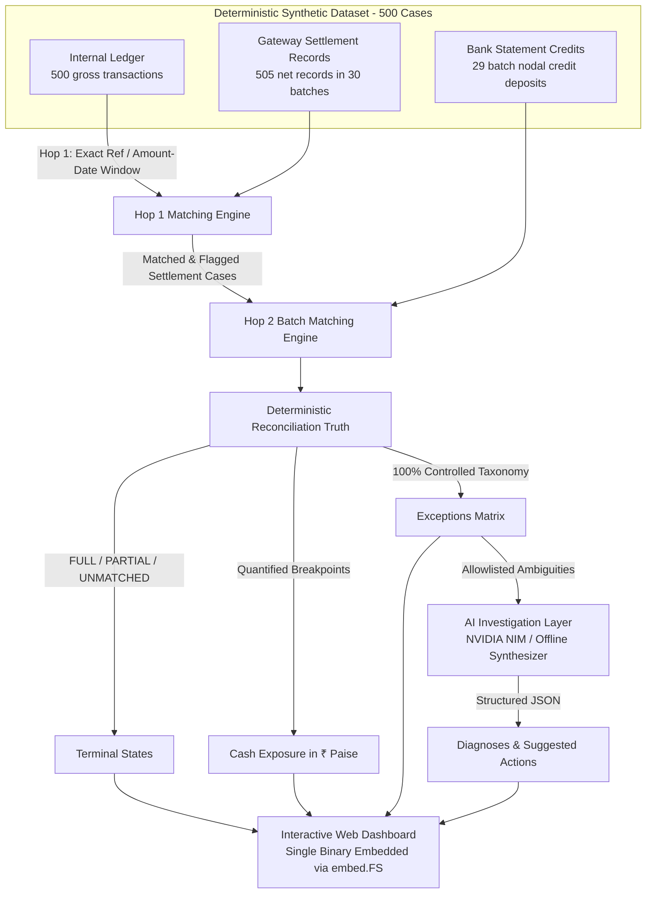

# AI Finance Controller
## Razorpay Buildathon · Track 04 — Run the Books and the Cash Position

> **A measured, auditable financial reconciliation engine that deterministically traces money across the internal ledger, gateway settlement records, and bank statements; identifies exactly where the money chain breaks; quantifies unresolved cash exposure in ₹ paise; and uses AI strictly to investigate ambiguous exceptions.**

---

### Core Principle
**Deterministic code establishes financial truth. AI explains ambiguity and provides operational insight into that truth.**

The AI model is never the authority for monetary amounts, transaction IDs, status determination, ground truth, or financial ledger writes.

---

## 1. System Architecture & Money-Flow Chain



The system closes the complete three-tier finance loop:
```text
Internal Ledger (Gross ₹)
      ↓  [Hop 1: Exact Ref, 2.5% fee discount tolerance, 0–3 day window]
Gateway Settlement (Net ₹)
      ↓  [Hop 2: Batch Reference, Aggregated Amount within ±2 days & ≤₹1]
Bank Statements (Batch Credits ₹)
```

---

## 2. Live Benchmark Results

*All numbers below are produced from live execution of the deterministic engine and evaluation against isolated ground truth (`evaluation/ground_truth/<run_id>.json`).*

```text
========================================================
             AI FINANCE CONTROLLER BENCHMARK            
 Run ID:  845a5ad8-cb0e-43a9-8cf6-10e3fefead96
 Seed:    42
 Version: v1.0.0 (Engine: v1.0.0)
 500 internal cases · 505 settlements · 29 bank lines
========================================================

 HOP 1 MATCH RATE              74.2%  (371 / 500 cases)
 HOP 2 BATCH MATCH RATE        80.0%  (24 / 30 batches)
 FULL-CHAIN RATE               59.6%  (298 / 500 reconciled)

 PRECISION (HOP 1)             98.4%  (TP: 365, FP: 6)
 RECALL (HOP 1)                93.6%  (TP: 365, FN: 25)
 FULL-CHAIN PRECISION          97.3%  (TP: 290, FP: 8)
 FULL-CHAIN RECALL             93.5%  (TP: 290, FN: 20)

 ENGINE THROUGHPUT            21726 records/sec
 ENGINE DURATION                 47 ms

 EXPECTED TO BANK           ₹2396470.42
 ACTUALLY BANKED            ₹2181618.85
 UNRESOLVED CASH EXPOSURE   ₹1497096.19  (149709619 paise)

 TOTAL EXCEPTIONS               338
 EXCEPTION COVERAGE          100.0%
--------------------------------------------------------
 EXCEPTION BREAKDOWN:
   · ORPHAN_SETTLEMENT         : 134
   · AMOUNT_MISMATCH           : 75
   · DUPLICATE_SETTLEMENT      : 54
   · SETTLED_NOT_BANKED        : 41
   · PARTIAL_CREDIT            : 32
   · BANKED_NOT_SETTLED        : 2
========================================================
```

### Multi-Seed Holdout Evaluation (`make benchmark-all`)
The reconciliation engine operates blindly on source records without knowledge of seed identity. Performance generalizes stably across unseen seeds:

| Dataset Seed | Cases | Hop 1 Match | Full Chain | Precision | Recall | Engine Throughput |
|---|---|---|---|---|---|---|
| **Development Seed (42)** | 500 | 74.2% | 59.6% | **98.4%** | **93.6%** | 26,581 rec/s |
| **Validation Seed (101)** | 500 | 73.0% | 58.0% | **98.1%** | **91.8%** | 26,248 rec/s |
| **Holdout Seed (999)** | 500 | 73.2% | 58.4% | **97.3%** | **91.3%** | 28,937 rec/s |

---

## 3. Quickstart: One-Command Demo

### Prerequisites
- **Go**: 1.22+ (tested on Go 1.27)
- **PostgreSQL**: 15+ (can run locally via `pg_ctl` or via Docker Compose)
- **Docker & Docker Compose** *(optional)*

### Single-Command Launch
```bash
make demo
```
This command automatically:
1. Starts PostgreSQL (via Docker Compose or local `pg_ctl`).
2. Runs database migrations (`000001_init_schema` and `000002_qa_security`).
3. Generates 500 deterministic synthetic cases and ingests source records into PostgreSQL.
4. Executes the deterministic reconciliation engine.
5. Runs AI exception investigation for eligible ambiguous cases.
6. Starts the HTTP server and opens the judge-facing dashboard at:
   👉 **http://localhost:8080**

---

## 4. System Invariants & Financial Guarantees

1. **No Silent Drops (Record Completeness)**:
   Every source record reaches an explicit terminal state:
   - **Internal Transactions (500 cases)**:
     - `FULL`: Hop 1 matched AND Hop 2 matched (**298 cases**)
     - `PARTIAL`: Hop 1 matched, but Hop 2 broken / shortfall (**73 cases**)
     - `UNMATCHED`: Hop 1 unmatchable / duplicate / mismatch (**129 cases**)
     - *Sum = 298 + 73 + 129 = 500 (100% accounted for)*
   - **Settlement Records**: `CONSUMED`, `ORPHAN` (`ORPHAN_SETTLEMENT`), or `AMBIGUOUS`.
   - **Bank Statements**: `CONSUMED` or `ORPHAN` (`BANKED_NOT_SETTLED`).

2. **Monetary Precision (Integer Paise)**:
   All money amounts are modeled as `int64` (paise). Floating-point math is strictly forbidden in financial calculations.

3. **Single Consumption & Conservation**:
   A settlement record can be consumed by at most one internal transaction. A bank credit can be matched to at most one settlement batch.

4. **Strict Ground-Truth Isolation**:
   Ground truth is generated outside the matcher and written strictly to `evaluation/ground_truth/<run_id>.json`. The reconciliation engine cannot access or import ground truth.

5. **AI Independence**:
   Running without AI credentials or offline yields **identical** financial amounts, status codes, and reconciliation results.

---

## 5. Reconciliation Engine & Exception Taxonomy

### Hop 1: Ledger ↔ Gateway Settlement
- **Rule 1 — Exact Reference**: Reference match with amount and date tolerance validation (Confidence: 1.0).
- **Rule 2 — Amount + 3-Day Window**: Net settlement amount within 2.5% discount tolerance (`settled >= gross * 0.975` and `settled <= gross`), settlement date 0–3 days later (Confidence: 0.9).
- **Rule 3 — Extended Date Window**: Settlement date 4–10 days later with valid amount tolerance (Confidence: 0.7, `flag_for_review = true`).
- **Rule 4 — No Counterpart**: Non-matching cases categorized via strict precedence:
  `DUPLICATE_SETTLEMENT` $\rightarrow$ `AMOUNT_MISMATCH` $\rightarrow$ `DATE_OUT_OF_RANGE` $\rightarrow$ `NO_COUNTERPART`.

### Hop 2: Settlement Batches ↔ Bank Statement
Hop 2 is batch-level (`SUM(settled_amount_paise)` across batch records):
- **Rule 1 — Batch Reference**: Exact reference match (`settlement.batch_id == bank.batch_reference`).
- **Rule 2 — Aggregated Amount**: For unreferenced credits, matches within ±2 days and amount difference $\le$ ₹1 (100 paise).
- **Breakpoints**:
  - `PARTIAL_CREDIT`: Bank credited amount < batch total $\rightarrow$ records shortfall and exposure.
  - `BANK_AMOUNT_MISMATCH`: Bank credit > batch total $\rightarrow$ records absolute delta.
  - `SETTLED_NOT_BANKED`: Settlement batch with no bank credit $\rightarrow$ exposure = batch total.
  - `BANKED_NOT_SETTLED`: Unexplained deposit in bank with no settlement batch.

---

## 6. AI Exception Investigation Layer

### Dual-Mode Operation
- **Online (NVIDIA NIM)**: Calls NVIDIA Inference Microservices (`meta/llama-3.3-70b-instruct`) via OpenAI-compatible endpoints with structured JSON schema validation. Supports cloud catalog (`https://integrate.api.nvidia.com/v1`) or self-hosted local NIM containers.
- **Offline / Deterministic Fallback**: If `NVIDIA_API_KEY` is not set or network is unreachable, an offline domain-specific financial synthesizer provides grounded diagnoses and actionable treasury steps.

### Safety & Boundaries
- **Strict Allowlist**: Only ambiguous cases invoke AI (`DUPLICATE_SETTLEMENT`, `AMOUNT_MISMATCH`, `SETTLED_NOT_BANKED`, `PARTIAL_CREDIT`, `BANK_AMOUNT_MISMATCH`). Routine clean matches bypass AI.
- **Fingerprint Caching**: In-memory SHA-256 cache `hash(run_id + category + record_id + reason)` prevents duplicate API calls on page reloads.
- **Prompt Injection Defense**: Source fields (narration, merchant text) are encapsulated strictly as untrusted data blocks.

---

## 7. Dual-Role Database Security Model

PostgreSQL enforces least-privilege access using two distinct roles:
1. **`finance_app`**: Normal read-write application user for data ingestion, reconciliation updates, and exception storage.
2. **`qa_readonly`**: Dedicated read-only role with table allowlists, transaction read-only enforcement (`default_transaction_read_only = on`), and a **3-second statement timeout** (`statement_timeout = '3000ms'`). Any mutation attempt (`CREATE TABLE`, `DROP`, `INSERT`) is rejected directly by PostgreSQL.

### 7.1 Settlement Q&A Interface *(Work in Progress / Beta)*

The dashboard includes a natural-language query interface over the verified reconciliation database. Queries are translated to read-only SQL, validated through a native PostgreSQL AST parser (`pg_query_go/v5`), and executed against the unprivileged `qa_readonly` role with a 3-second statement timeout.

> **Status Notice: Work in Progress (Beta)**  
> Natural-language query translation and entity context mapping are currently undergoing active refinement. While the native AST validator and dual-role database security guarantees are strictly enforced, complex ad-hoc queries may yield approximate results. The deterministic Money-Flow Chain and Exceptions Matrix remain the authoritative financial ground truth.

### 7.2 CSV Ingestion with AI Column Mapping (NVIDIA NIM)

Users can ingest raw CSV dumps from any external provider (Razorpay exports, HDFC/ICICI bank statement extracts, internal ERP dumps) without manual reformatting or hardcoded schemas:

```text
Raw CSV (Messy Headers, ₹ Currency, Indian Dates)
       ↓
CSV Cleaner (BOM strip, CRLF/LF normalization, Excel PK\x03\x04 rejection)
       ↓
NVIDIA NIM / Fallback Heuristic Mapper (Semantic column inference + confidence scoring)
       ↓
Interactive Confirmation Screen (Green/Yellow/Red pills, dropdown overrides, date format picker)
       ↓
Streaming Batch Ingestion (PostgreSQL upsert in chunks of 100 on conflict)
       ↓
1-Click Automated Reconciliation (Re-runs Hop 1 + Hop 2 engine & triggers AI investigation)
```

#### Supported Sources & Canonical Schemas

| Target Source | Required Canonical Fields | Optional Fields |
|---|---|---|
| **Internal Ledger** (`internal`) | `id`, `amount`, `transaction_date`, `merchant_id` | `currency`, `reference_id` |
| **Gateway Settlement** (`settlement`) | `id`, `settled_amount`, `settlement_date`, `merchant_id`, `batch_id` | `currency`, `reference_id` |
| **Bank Statement** (`bank`) | `id`, `credited_amount`, `credit_date`, `merchant_id`, `batch_reference` | `narration` |

#### Ingestion & Validation Hardening
- **BOM & Encoding Resilience**: Automatically strips UTF-8 BOM (`\xef\xbb\xbf`), normalizes line endings (`\r\n` $\rightarrow$ `\n`), falls back to Latin-1 on encoding errors.
- **Excel Binary Rejection**: Detects `.xlsx` magic bytes (`PK\x03\x04`) and prompts the user to export as CSV.
- **Monetary Value Normalization**: Strips currency prefixes (`₹`, `$`, `INR`, `USD`), strips thousands commas (`5,214.63` $\rightarrow$ `521463` paise), and translates accounting negative parentheses `(500.00)` $\rightarrow$ `-50000` paise.
- **Date Format Resilience**: Autodetects and parses Unix timestamps (10/13 digit), ISO 8601/RFC 3339, Indian format (`DD/MM/YYYY HH:mm:ss`), and standard dates.
- **Data Integrity Thresholds**: Ingestion is rejected if $>5\%$ of rows fail date parsing, or if duplicate transaction IDs exist within the uploaded batch.

---

## 8. Operations & Command Reference

```bash
# Start PostgreSQL (Docker or local pg_ctl)
make up

# Apply database migrations (dual-role security)
make migrate

# Cleanly truncate operational tables (idempotent runs)
make reset

# Generate synthetic dataset and ingest into DB
make seed

# Run deterministic reconciliation engine
make reconcile

# Run AI exception investigation
make investigate

# Run single-seed benchmark (SEED=42)
make benchmark

# Run multi-seed holdout benchmark (seeds 42, 101, 999)
make benchmark-all

# Run full test suite with race detector (invariants, AST safety, Q&A, CSV ingestion)
make test

# Start the complete end-to-end demo (resets, seeds, reconciles, investigates, serves dashboard)
make demo
```

### API Reference for CSV Ingestion & Execution

| Method | Endpoint | Description |
|---|---|---|
| `POST` | `/api/ingest/analyze` | Multipart upload (up to 50MB) + `source`. Returns inferred column mappings, confidence scores, and preview rows. |
| `POST` | `/api/ingest/commit` | Commits column mappings, validates schema constraints, upserts rows in batches of 100, and updates run metrics. |
| `GET` | `/api/runs/{runID}/sources-status` | Returns upload progress and counts for all 3 sources (`internal`, `settlement`, `bank`) and completeness flag. |
| `POST` | `/api/runs/{runID}/reconcile` | Triggers the 2-hop reconciliation engine on the specified run and launches async AI exception investigation. |
| `GET` | `/api/samples/{source}` | Downloads standard clean synthetic CSV (`source` = `internal`, `settlement`, or `bank`). |
| `GET` | `/api/samples/messy/{source}` | Downloads realistic messy CSV with non-standard headers, currency symbols, and Indian timestamp formatting. |


